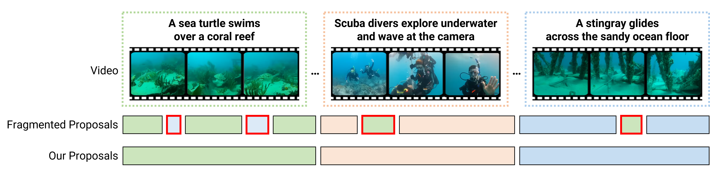

# TAG: A Simple Yet Effective Temporal-Aware Approach for Zero-Shot Video Temporal Grounding

In this work, 



## Quick Start

### Requiments
- python=3.8
- pytorch==2.0.1
- torchvision==0.15.2
- pytorch-cuda=11.7
- torchaudio==2.0.2
- tqdm
- scikit-learn
- ipykernel
- seaborn
- statsmodels
- patsy


## Main Results

### Standard Split

```bash
# Charades-STA dataset
python evaluate.py --dataset charades --llm_output dataset/charades-sta/llm_outputs.json --tckmeans

# ActivityNet dataset
python evaluate.py --dataset activitynet --llm_output dataset/activitynet/llm_outputs.json --tckmeans
```

| Dataset        | IoU=0.3 | IoU=0.5 | IoU=0.7 |  mIoU   |
| :-----         | :-----: | :-----: | :-----: | :-----: |
|  Charades-STA  |  67.82  |  48.58  |  26.67  |  45.69  |
|  ActivityNet   |  51.88  |  28.91  |  15.07  |  36.55  |


### OOD Splits

```bash
# Charades-STA OOD-1
python evaluate.py --dataset charades --split OOD-1

# Charades-STA OOD-2
python evaluate.py --dataset charades --split OOD-2

# ActivityNet OOD-1
python evaluate.py --dataset activitynet --split OOD-1

# ActivityNet OOD-2
python evaluate.py --dataset activitynet --split OOD-2
```

| Dataset              | IoU=0.3 | IoU=0.5 | IoU=0.7 |  mIoU   |
| :-----               | :-----: | :-----: | :-----: | :-----: |
|  Charades-STA OOD-1  |  68.25  |  45.27  |  23.20  |  44.71  |
|  Charades-STA OOD-2  |  68.31  |  44.11  |  21.99  |  44.62  |
|  ActivityNet OOD-1   |  51.42  |  28.52  |  14.68  |  36.19  |
|  ActivityNet OOD-2   |  51.23  |  28.34  |  14.54  |  36.05  |


```bash
# Charades-CD test-ood
python evaluate.py --dataset charades --split test-ood

# Charades-CG novel-composition
python evaluate.py --dataset charades --split novel-composition

# Charades-CG novel-word
python evaluate.py --dataset charades --split novel-word
```

| Dataset                           | IoU=0.3 | IoU=0.5 | IoU=0.7 |  mIoU   |
| :-----                            | :-----: | :-----: | :-----: | :-----: |
|  Charades-STA test-ood            |  68.09  |  49.45  |  26.58  |  45.97  |
|  Charades-STA novel-composition   |  64.38  |  43.55  |  21.30  |  41.95  |
|  Charades-STA novel-word          |  68.49  |  52.37  |  32.66  |  47.86  |


## Acknowledgement

This repository is built upon the official implementation of [TFVTG (ECCV 2024)](https://github.com/minghangz/TFVTG). We thank the authors for their valuable contributions and open-source code.
